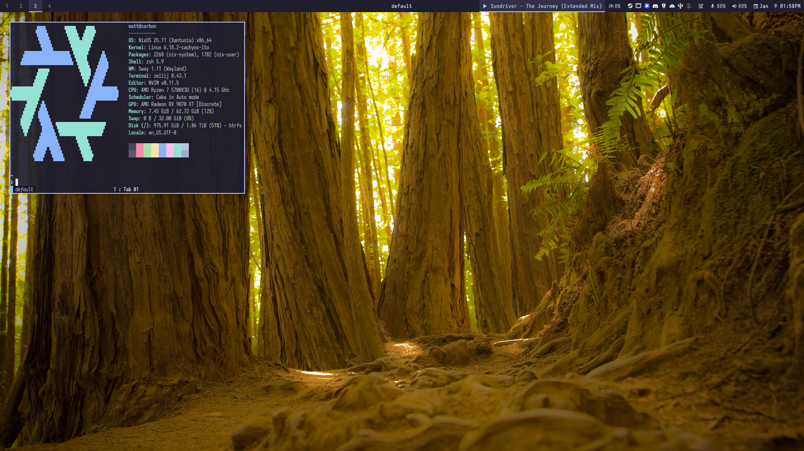

# Dotfiles

> My personal configuration repository that builds my desktop environment.

My dotfiles are managed by two tools, a Nix flake that configures my systems
running NixOS, and [chezmoi](https://www.chezmoi.io/) that configure my user
environments across NixOS and non-NixOS systems.

## Highlights

- **[Sway](https://swaywm.org/) via
  [UWSM](https://github.com/Vladimir-csp/uwsm)** - I use Sway as my window
  manager with the Universal Wayland Session Manager to properly integrate with
  systemd and logind.
- **Secure Boot via
  [Lanzaboote](https://github.com/nix-community/lanzaboote)** - My custom keys
  sign the bootloader and kernel images to support enabling Secure Boot. This
  assures the system's integrity at boot and enables safe storage of disk
  encryption keys in the TPM with
  [`systemd-cryptenroll`](https://www.freedesktop.org/software/systemd/man/251/systemd-cryptenroll.html).
- **[CachyOS kernel](https://wiki.cachyos.org/features/kernel/)** - My desktop
  runs the CachyOS kernel, a customized kernel tuned for performance and
  responsiveness via the
  [nix-cachyos-kernel flake](https://github.com/xddxdd/nix-cachyos-kernel).
- **[sched_ext](https://github.com/sched-ext/scx)** - My configuration adds a
  [NixOS module for the `scx_loader` service](https://github.com/NixOS/nixpkgs/pull/445224)
  and patches in the experimental, gaming-focused
  [`scx_cake` scheduler](https://github.com/sched-ext/scx/pull/3202).
- **[llama-swap](https://github.com/mostlygeek/llama-swap)** - My desktop hosts
  an OpenAI API compatible service for my network, powered by llama-swap and
  [llama.cpp](https://github.com/ggml-org/llama.cpp) using the Vulkan backend
  with my RX 9070 XT. At present, I host only
  [gpt-oss-20b](https://huggingface.co/ggml-org/gpt-oss-20b-GGUF).
- **[Games on Whales Wolf](https://games-on-whales.github.io/wolf)** - My
  desktop hosts a [Moonlight](https://moonlight-stream.org/)-compatible game
  streaming service, Wolf, powered by Docker containers. This enables me to
  stream games to less-powerful devices while also not disturbing or having any
  dependence on my desktop session like with
  [Sunshine](https://app.lizardbyte.dev/Sunshine). This is configured through a
  [custom NixOS module](modules/nixos/wolf/default.nix).

## Why not [Home Manager](https://github.com/nix-community/home-manager)?

While I previously used use Home Manager, I found it overcomplicated and
limiting for my use case. Chezmoi lets me easily support NixOS and non-NixOS
systems, including Windows. More conveniently, it doesn't pollute my home
directory with immutable symlinks to the Nix store allowing me to change
settings directly in apps and then commit them with Chezmoi later using
`chezmoi re-add`. Performance when iterating changes is also significantly
faster.
